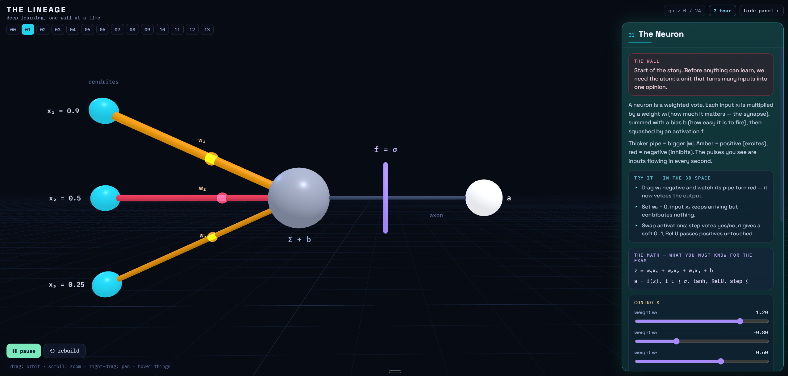

# The Lineage — deep learning, one wall at a time

An interactive 3D museum that teaches the lineage of deep learning architectures. Walk through 14 stations — from a single neuron to the Transformer — where every concept is a live, clickable simulation: fire a perceptron, watch gradients flow backward, feed tokens through an LSTM, and see self-attention resolve a pronoun in real time.



## Stations

| Chapter | Stations |
|---|---|
| Basics | The Neuron · The Perceptron · MLP / Feedforward Nets · Gradient Descent + Backprop |
| Vision | The CNN |
| Sequences | The RNN · LSTM / GRU · Encoder–Decoder (seq2seq) |
| Attention | RNN + Attention · Self-Attention · Cross-Attention (+ masking) |
| Modern | The Transformer (full assembly) · The GAN |

Each station has guided "watch" steps, hover tooltips on every 3D object, interactive controls (fire, shuffle, toggle masking…), and a quiz.

## Try it

**Live: https://parsabuilds.github.io/DeepLearningConceptsSimulation/**

## Running it locally

No build step, no dependencies to install — it's plain HTML + JS with a vendored copy of three.js.

```bash
# from the repo root
python3 -m http.server 8000
# then open http://localhost:8000
```

(Opening `index.html` directly from the file system works in most browsers too.)

## Project structure

| File | What it is |
|---|---|
| `index.html` | Entry point — UI shell, station definitions, lesson text, quizzes |
| `support.js` | Loader / runtime support |
| `engine-bundle.js` | Pre-built bundle of the engine + all scenes (what the page actually loads) |
| `engine.js` | 3D world engine source (`<dl-world>` custom element, camera, picking, HUD) |
| `kit.js` | Shared helpers — palette, math (softmax, sigmoid), easing, scene registry |
| `scenes-basics.js` | Neuron, perceptron, MLP, backprop, CNN scenes (source) |
| `scenes-seq.js` | RNN, LSTM/GRU, seq2seq scenes (source) |
| `scenes-attn.js` | Attention, self-attention, Transformer scenes (source) |
| `vendor/` | three.js (vendored, no CDN needed) |

Note: the page loads `engine-bundle.js`, which is the bundled version of `engine.js` + `kit.js` + the `scenes-*.js` files. If you edit the individual source files, mirror the change in the bundle (or rebundle) for it to show up.

## Contributing

Issues and PRs welcome — new stations, better visual metaphors, fixes to the explanations, anything.

## Credits

Built with [Claude](https://claude.ai) (Claude Design). Licensed under the [MIT License](LICENSE).
